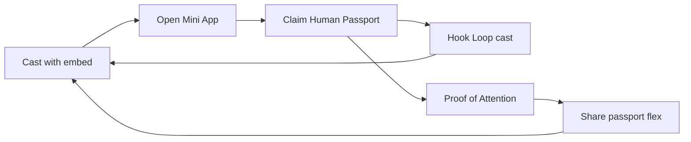

# Farcaster Growth — Building Culture / Human Economy

**Live Mini App domain:** `mining.buildingcultureid.space`  
**Manifest:** `https://mining.buildingcultureid.space/.well-known/farcaster.json`  
**Product surface:** `?fc=1` (home), Hook Loop, Human Passport

This is the maximum-growth launch kit. Ship the unsigned manifest first, **sign ownership**, then rain casts.

---

## 0) You must do once (custody sign)

1. Confirm manifest is live:
   ```bash
   curl -s https://mining.buildingcultureid.space/.well-known/farcaster.json | head
   ```
2. Open the Manifest Tool with your domain:
   [https://farcaster.xyz/~/developers/mini-apps/manifest?domain=mining.buildingcultureid.space](https://farcaster.xyz/~/developers/mini-apps/manifest?domain=mining.buildingcultureid.space)
3. **Claim Ownership** → sign with your Farcaster custody address (phone).
4. Paste the returned `accountAssociation` into `public/.well-known/farcaster.json` and redeploy.
5. Green check = verified Mini App → eligible for Warpcast developer rewards.

Until step 4, discovery works but the app is **not verified**.

---

## 1) What we shipped in product

| Piece | Where |
| --- | --- |
| Mini App manifest | `public/.well-known/farcaster.json` |
| Cast compose helpers | `src/lib/farcaster.ts` |
| Cast buttons + growth deck | `src/components/FarcasterCastButton.tsx` |
| Landing rain deck | `HumanEconomyLanding` |
| Hook Loop → Cast unlocks | `HookLoopCampaign` |
| Embed meta | `index.html` (`fc:miniapp` + `fc:frame`) |
| Webhook stub | `POST /api/farcaster/webhook` |

In-app: **Cast on Farcaster** opens `farcaster.xyz/~/compose` with text + embed.

---

## 2) Launch day cast calendar (copy / paste)

Use the in-app Growth Deck, or compose manually. Prefer channels: `/builders`, `/base`, `/onchain`, `/creators`, `/attention`.

### Day 0 — Launch thread (pin)

**Cast 1 — hero**

```
Human value was never measured correctly.

For centuries we measured people by the hours they worked.
The AI era needs a new measurement:
what you learn · create · contribute.

Building Culture = Human Economy.
Build your Human Passport.

https://mining.buildingcultureid.space/?fc=1
```

**Cast 2 — reply**

```
2/
Time = Money was industrial age math.
AI writes, codes, generates.

The scarce asset is verified human contribution.
That's the Human Economy.
```

**Cast 3 — reply CTA**

```
3/
Open the Mini App. Claim a Human Passport.
Then cast a Hook Loop truth — unlock the next one.

Builders / parents / learners welcome.
https://mining.buildingcultureid.space/?fc=1
```

### Day 1 — Hook Loop viral

```
How they hook you into doomscrolling.

Fun memes. Real mechanics.
Share a truth → unlock the next.
Perfect loop. Honest this time.

https://mining.buildingcultureid.space/?room=hook-loop&fc=1
```

Ask 5 friends to quote-cast with their own Hooking Truth (in-app Cast button advances the loop).

### Day 2 — Passport

```
Your LinkedIn flex is a résumé.
Your Human Passport is reputation you own.

Human Value = Contribution
Prove attention. Grow Knowledge · Builder · Contribution.

Build Your Human Passport
https://mining.buildingcultureid.space/?fc=1
```

### Day 3 — Proof of Attention

```
Empty scrolling is not contribution.

Proof of Attention = short challenges that move your Knowledge Score.
~2 minutes. Then your passport updates.

https://mining.buildingcultureid.space/?fc=1
```

### Day 4 — Hearing Mode

```
Prove attention without looking at the screen.

Hearing Mode — ears-first Human Economy.
Say Help. Start a challenge. Own the receipt.

https://mining.buildingcultureid.space/?hear=1&fc=1
```

### Day 5 — Business model (trust)

```
How Building Culture makes money (clear, not extractive):

• Human Passport Pro — $9.99/mo
• Human Intelligence Platform — $999–$5k/mo (companies)
• Creator marketplace — platform fee

Core Proof of Attention stays free.
https://mining.buildingcultureid.space/?fc=1
```

### Day 6–7 — Engagement rain

- Reply to every newcaster who opens the Mini App.
- Daily Hook Loop cast from a new truth ID.
- Quote-cast builders who say “attention economy” / “reputation” / “learn to earn”.
- Post a 30s screen recording of passport claim → first PoA → cast.

---

## 3) Growth loops (product → social)



1. **Compose loop** — every share surface has Cast on Farcaster.
2. **Hook Loop** — casting a truth unlocks the next (same as share).
3. **Passport flex** — after claim, prompt Cast template `passport`.
4. **Embed preview** — `fc:miniapp` makes every link a launch card.

---

## 4) Channels & tags

| Channel | Angle |
| --- | --- |
| `/builders` | Human Passport + product |
| `/base` / `/onchain` | Mini App + reputation |
| `/creators` | Marketplace + contribution |
| `/memes` | Hook Loop only |
| `/a11y` | Hearing Mode |

Hashtags (sparingly): `#HumanEconomy` `#HumanPassport` `#HookLoop` `#ProofOfAttention`

---

## 5) Optional next (Neynar API)

When you have a Neynar API key:

1. Add `NEYNAR_API_KEY` to server `.env` (never `VITE_`).
2. Publish scheduled casts from a small cron (do not spam).
3. Verify webhook signatures on `/api/farcaster/webhook`.
4. Enable Mini App notifications after `accountAssociation` is signed.

Docs: [Neynar Mini Apps](https://docs.neynar.com/docs/convert-web-app-to-mini-app)

---

## 6) Checklist before “we’re live”

- [ ] `curl` manifest → 200 JSON with `miniapp`
- [ ] `accountAssociation` signed + redeployed
- [ ] Cast with `?fc=1` shows **Build Passport** embed button
- [ ] Landing Growth Deck opens compose
- [ ] Hook Loop Cast unlocks next truth
- [ ] Launch thread (3 casts) posted
- [ ] 10 DMs / replies to early openers same day

Rain starts after the signed manifest + launch thread. Everything else is amplification.
